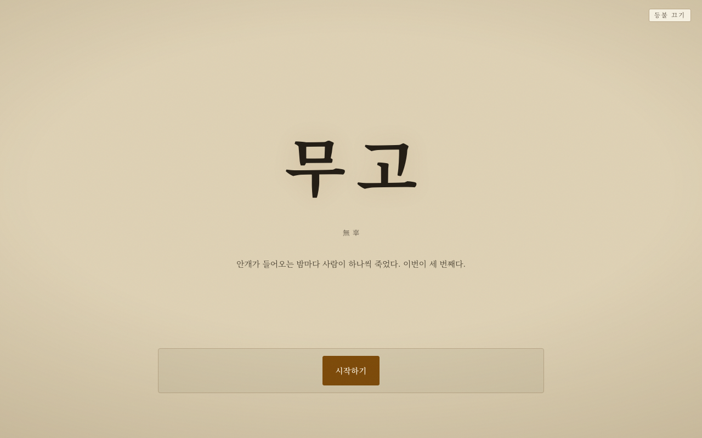

# 무고 — 誣告 · 無辜

안개 낀 항구 마을. 연쇄살인 사건을 심문하는 탐정이 되어, 당신의 한마디로 용의자의 생사가 갈립니다.



당신이 심문하는 남자는 이 게임을 먼저 한 사람입니다. 그가 화면에 쓴 세 마디가 그대로 당신 앞에 놓이고, 「유죄」를 누르면 그 사람의 메일함으로 통지가 갑니다. 그리고 그날 밤, 같은 일이 당신에게 일어납니다.

## 플레이

https://mug0.onrender.com/

한 판 20~30분. 무료 서버라 접속이 뜸하면 15분 뒤 잠들고, 첫 접속에 30초쯤 걸립니다.

로컬 실행:

```bash
npm install
npm start   # http://localhost:8787
```

## 이어달리기가 성립하려면

이 게임의 핵심은 내 진술이 다음 사람에게 넘어가고, 며칠 뒤 판결이 메일로 오는 것입니다. 그래서 서버와 데이터베이스가 필요합니다. 정적 호스팅으로는 안 됩니다.

| | 되는 것 | 안 되는 것 |
|---|---|---|
| 정적 호스팅 | 혼자 처음부터 끝까지 플레이 | 이어달리기 전부. 미리 써둔 조서만 나옴 |
| 서버만 (DB 없음) | 서버가 깨어 있는 동안은 이어달리기 | 재배포·재시작하면 대기열이 사라짐 |
| 서버 + Postgres + SMTP | 전부 | — |

환경변수(`DATABASE_URL`, `BREVO_API_KEY`/`RESEND_API_KEY`/`SMTP_URL`, `MAIL_FROM`, `PUBLIC_URL`)가 없어도 게임은 돌아갑니다. 없는 만큼만 기능이 빠집니다 — 자세한 조합은 `server.js`, `mailer.js` 참고.

Render 무료 플랜은 2025-09-26부터 SMTP 포트(25/465/587)를 막아서, 메일은 포트 없이 API로 보내는 Brevo를 씁니다. 배포는 `render.yaml` 그대로, 비밀 값은 대시보드 Environment에 직접 넣습니다.

## 조서를 누구에게 주는가

지어낸 조서(`seeds.js`)를 주면 그 판은 아무와도 안 엮입니다. 그래서 실제 플레이어가 쓴 조서를 항상 먼저 줍니다 — 안 건드린 것, 없으면 아직 판결 안 난 것을 나눠서, 그것도 없으면 덜 읽힌 것부터 다시. 지어낸 조서는 정말 줄 게 하나도 없을 때만 나갑니다.

자기 진술, 자기가 이미 판결한 조서, 손으로 빼둔 조서는 제외합니다. 판결까지 안 가고 나가면 30분 뒤 자리를 놓습니다. 통지는 한 조서에 두 통까지고, 판결이 갈려도 맞추지 않습니다 — 둘 다 남고 조서 번호로 순서대로 보입니다.

## 개인정보

메일 주소는 판결 통지를 보내는 데만 쓰고, 마지막 통지가 나간 다음 DB에서 지웁니다. 발송 실패 시에는 다시 보낼 수 있게 남겨둡니다(`tools/resend.js`). 주소 없이도 플레이는 끝까지 되고, 조서 번호로 판결을 직접 확인할 수 있습니다.

## 구조

```
server.js     HTTP + 정적 파일. 진술 꺼내주기 / 판결 받기 / 진술 넣기
store.js      Postgres 또는 JSON 파일, 같은 인터페이스
mailer.js     판결 통지. Brevo → Resend → SMTP → 콘솔 순
seeds.js      사람이 쓴 조서가 없을 때만 나가는 조서 10개
public/       대본(story.js), 관찰 장면(plates.js), 진행부(game.js)
tools/        분기도 추출, 대기열 조회, 통지 재발송, 대기열 손질(admin.js)
```

## API

| | |
|---|---|
| `POST /api/case` | 대기열 맨 앞 진술을 꺼내 자리 하나를 잡음 (30분 뒤 자동 해제) |
| `POST /api/verdict` | 판결 기록 + 앞사람에게 메일 |
| `POST /api/statement` | 내 진술을 대기열에 넣고 조서 번호를 받음 |
| `GET /api/statement/:token` | 내 판결이 나왔는지 확인 |

---

개인적으로 만든 것이며 배포나 상업적 목적이 아닙니다.

<details>
<summary>더 알아보기 (스포일러 있음)</summary>

제9장에서 내가 쓴 답은 다음 사람의 제2장 심문 화면으로, 제8장에서 수첩에서 찢어낸 장은 다음 사람에게 "계획적이었다"는 결론으로만, 제2장에서 내린 판결은 앞사람의 메일함으로 넘어갑니다. 각 조서는 최대 두 사람이 읽을 수 있어서, 같은 사건에 판결이 두 개 남는 경우도 있습니다.

</details>
